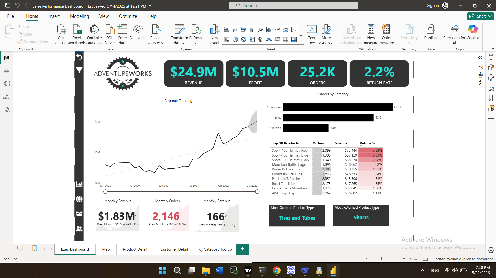
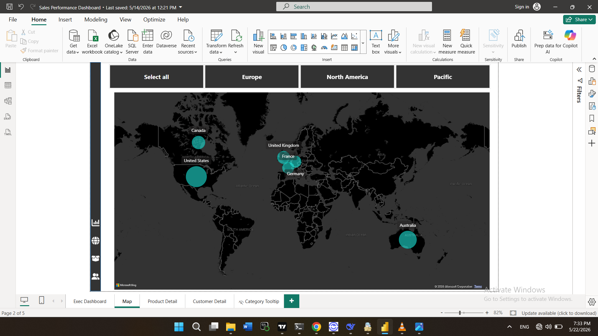
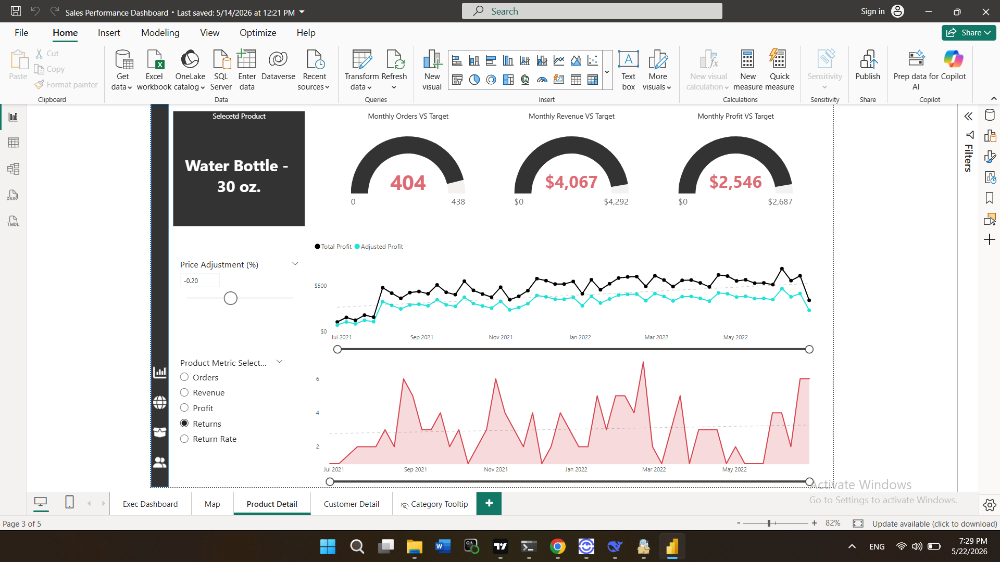
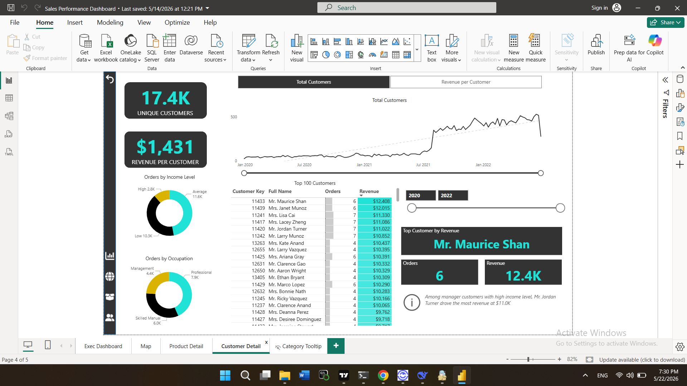
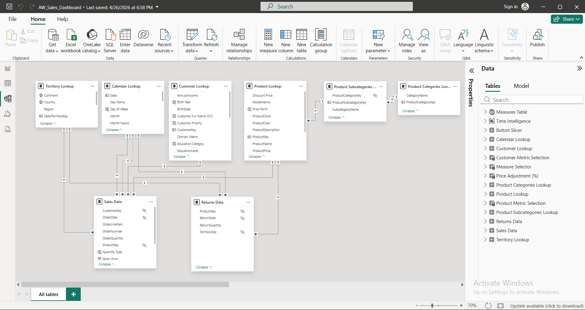

# AdventureWorks Sales Performance Dashboard

## Overview
Interactive Power BI dashboard built using the AdventureWorks dataset to analyze sales performance, profitability, product performance, customer behavior.

## Dashboard Preview

## Business Context
AdventureWorks is a fictional global retail company selling bikes, accessories, and clothing. This project was built to answer three core business questions:
1. How is the business performing overall? — Track revenue, profit, orders, and return rates against targets.
2. Which products drive (or hurt) profitability? — Identify top performers and high-return items to guide inventory decisions.
3. Who are the most valuable customers? — Segment customers by revenue contribution and purchasing behavior.

## Business Insights
- Revenue reached $24.9M across the analysis period.
- Bikes generated the highest contribution to overall profit.
- Product returns remained relatively low at 2.2%, helping maintain profitability.
- Revenue growth accelerated during the second half of the reporting period.
- Customers in management and professional occupations contribute a large share of revenue.

## Technical Approach

### Data Modeling
A star schema was built using separate sales and returns fact tables connected to shared product, customer, and date dimensions. This structure supports consistent filtering and simplifies DAX calculations across the model.

### Data Analysis Expressions (DAX)
DAX measures were created for revenue, profit, orders, returns, return rate, and time-based analysis. Most business logic was implemented as measures rather than calculated columns to keep the model flexible and easier to maintain.

### Visualizations
The dashboard combines KPI cards, trend analysis, geographic mapping, drill-through navigation, and customer segmentation visuals. Each page focuses on a different area of analysis, allowing users to move from high-level performance metrics to detailed product and customer insights.

## Dashboard Pages
1. Executive Summary — High-level KPI cards, a 30-month revenue trend line, and top-10 product rankings
2. Geographic Map — Order volume visualized by country and region using an interactive map
3. Product Detail — Drill-through page showing individual product performance vs. target with gauge visuals
4. Customer Detail — Customer segmentation by revenue, order count, and occupation/income tier

## Interactivity Features
- Slicers for year and continent filtering across all pages
- Drill-through from the executive page to individual product detail
- Navigation buttons for seamless page switching
- Conditional formatting on KPI cards to highlight above/below-target performance

## Tools & Skills
| Area | Details |
|------|---------|
| Tool | Power BI Desktop |
| Data Prep | Power Query (M language) |
| Analysis | DAX (calculated columns, measures, time intelligence) |
| Modeling | Star schema, relationship management |
| Design | Dashboard layout, UX navigation, color-coded KPIs |
| Dataset | Microsoft AdventureWorks sample (2020–2022) |

## Files

[Power BI Dashboard](AdventureWorks_Sales_Dashboard.pbix): Full Power BI dashboard 

[Screenshots](images/): Dashboard and data model screenshots

## Contact

**Amirabas Ziaee**
- LinkedIn: https://www.linkedin.com/in/amirabasziaee
- Email: aaziaee04@gmail.com
